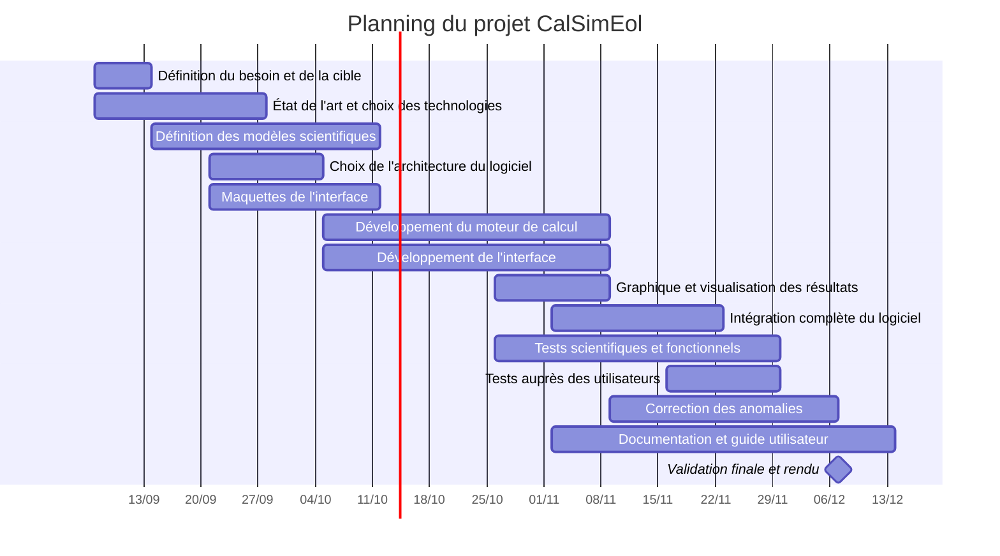

# Planning du projet CalSimEol

```mermaid
gantt
    title Planning du projet CalSimEol
    dateFormat YYYY-MM-DD
    axisFormat %d/%m

    Définition du besoin et de la cible :a1, 2026-09-07, 7d
    État de l'art et choix des technologies :a2, 2026-09-07, 21d
    Définition des modèles scientifiques :a3, 2026-09-14, 28d
    Choix de l'architecture du logiciel :a4, 2026-09-21, 14d
    Maquettes de l'interface :a5, 2026-09-21, 21d
    Développement du moteur de calcul :a6, 2026-10-05, 35d
    Développement de l'interface :a7, 2026-10-05, 35d
    Graphique et visualisation des résultats :a8, 2026-10-26, 14d
    Intégration complète du logiciel :a9, 2026-11-02, 21d
    Tests scientifiques et fonctionnels :a10, 2026-10-26, 35d
    Tests auprès des utilisateurs :a11, 2026-11-16, 14d
    Correction des anomalies :a12, 2026-11-09, 28d
    Documentation et guide utilisateur :a13, 2026-11-02, 42d
    Validation finale et rendu :milestone, a14, 2026-12-07, 0d
```
